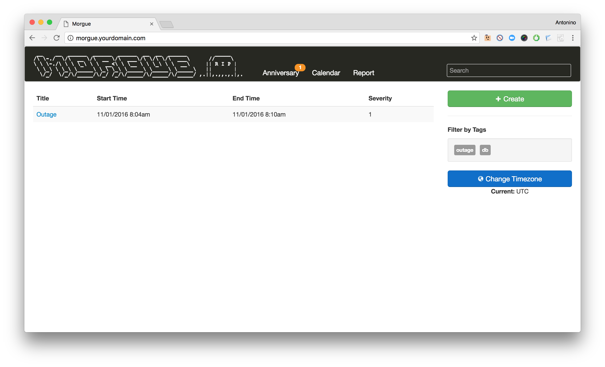
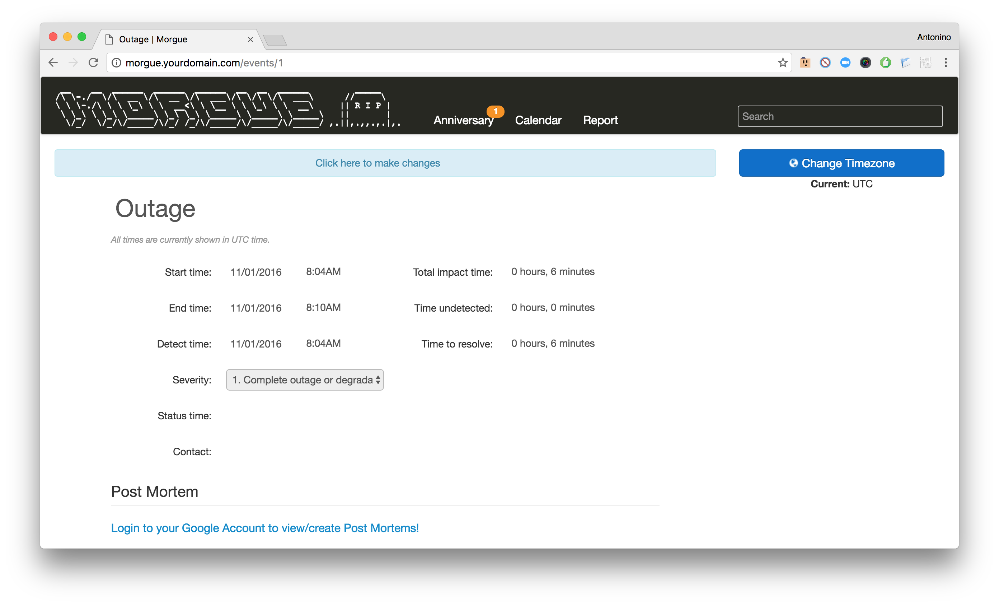

#   Morgue

This application helps managing your postmortems. It has a pluggable feature system and can pull in related information from IRC and JIRA as well as storing relevant links and graphs.

Morgue consists of two containers: one mariadb database and the application (Apache + PHP 5).

The Morgue container is built from scratch starting from Alpine Linux and Morgue source code (https://github.com/etsy/morgue). 

## Requirements
- docker
- docker-compose

## How to run it
First change the configurations in `example.json` file, then start morgue executing:
```
$  docker-compose up -d
```

Once done, login to morgue using the credentials `morgue:P0stm0rt3ms!`





* Default url: <http://morgue.yourdomain.com/>
